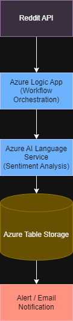

# Azure Logic App - Sentiment Analysis Pipeline

This project is a serverless workflow built using Azure Logic Apps that:

- Pulls data from the Reddit API
- Analyzes sentiment using Azure AI Language Services
- Stores results in Azure Table Storage
- Triggers alerts for negative sentiment

## Technologies Used

- Azure Logic Apps
- Azure AI Language Service
- Azure Table Storage
- REST APIs (Reddit)
- JSON Parsing

## Architecture

The workflow:
1. Authenticates with Reddit API
2. Retrieves posts from selected subreddits
3. Processes text through Azure AI sentiment analysis
4. Stores and evaluates results

## Architecture Diagram

